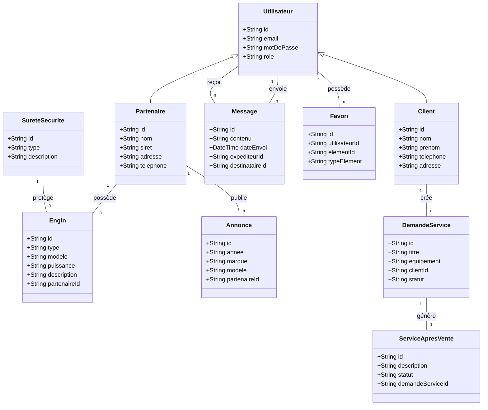

```mermaid
classDiagram
    class Utilisateur {
        +String id
        +String email
        +String motDePasse
        +String role
    }

    class Client {
        +String id
        +String nom
        +String prenom
        +String telephone
        +String adresse
    }

    class Partenaire {
        +String id
        +String nom
        +String siret
        +String adresse
        +String telephone
    }

    class Engin {
        +String id
        +String type
        +String modele
        +String puissance
        +String description
        +String partenaireId
    }

    class Annonce {
        +String id
        +String annee
        +String marque
        +String modele
        +String partenaireId
    }

    class DemandeService {
        +String id
        +String titre
        +String equipement
        +String clientId
        +String statut
    }

    class Message {
        +String id
        +String contenu
        +DateTime dateEnvoi
        +String expediteurId
        +String destinataireId
    }

    class Favori {
        +String id
        +String utilisateurId
        +String elementId
        +String typeElement
    }

    class ServiceApresVente {
        +String id
        +String description
        +String statut
        +String demandeServiceId
    }

    class SureteSecurite {
        +String id
        +String type
        +String description
    }

    %% Relations
    Utilisateur <|-- Client
    Utilisateur <|-- Partenaire
    
    Client "1" -- "n" DemandeService : crée
    Partenaire "1" -- "n" Engin : possède
    Partenaire "1" -- "n" Annonce : publie
    
    DemandeService "1" -- "1" ServiceApresVente : génère
    
    Utilisateur "1" -- "n" Message : envoie
    Utilisateur "1" -- "n" Message : reçoit
    
    Utilisateur "1" -- "n" Favori : possède
    
    SureteSecurite "1" -- "n" Engin : protège
``` 